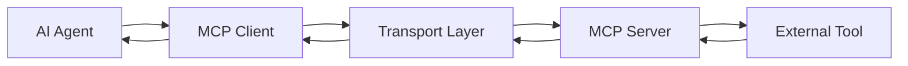

# Introduction to MCP (Model Context Protocol)

The Model Context Protocol represents a fundamental shift in how AI agents interact with external systems, transforming LLMs from text generators into action-taking entities capable of autonomous work.

## What is MCP?

MCP is an open standard developed by Anthropic that provides a universal interface for Large Language Models to interact with external tools, data sources, and services in a structured, secure manner.

### Core Concepts

**Universal Interface**
- Standardized protocol for LLM-tool communication
- JSON-RPC 2.0 over HTTP or stdio transport
- Consistent API across different tools and services

**Bidirectional Communication**
- LLMs can query tools for information
- Tools can provide structured responses
- Real-time interaction capabilities

**Security by Design**
- Explicit permission models
- Sandboxed execution environments
- Audit trails for all interactions

## The Problem MCP Solves

### Before MCP: Fragmented Integration

Traditional AI integration required:
```python
# Custom API for each service
github_client = GitHubAPI(token)
slack_client = SlackAPI(token)
database = PostgreSQL(connection_string)

# Different interfaces for each tool
github_issues = github_client.get_issues()
slack_messages = slack_client.send_message()
db_results = database.execute_query()
```

**Problems:**
- Each integration requires custom code
- No standardization across tools
- Limited discoverability of capabilities
- Complex maintenance and updates

### After MCP: Universal Protocol

```python
# Single interface for all MCP-compatible tools
mcp_client = MCPClient()

# Discover available tools
tools = mcp_client.list_tools()

# Use any tool with same interface
result = mcp_client.call_tool("github_get_issues", {"repo": "example"})
message = mcp_client.call_tool("slack_send_message", {"text": "Update"})
data = mcp_client.call_tool("database_query", {"sql": "SELECT * FROM users"})
```

**Benefits:**
- Unified interface for all tools
- Automatic capability discovery
- Plug-and-play tool integration
- Reduced integration complexity

## Simple vs Agentic APIs

### Simple Completion APIs

Traditional AI APIs follow a request-response pattern:

```
User Prompt → LLM → Text Response
```

**Characteristics:**
- Stateless interactions
- Text-only input/output
- No external tool access
- Limited to training data knowledge

**Example:**
```python
response = openai.ChatCompletion.create(
    model="gpt-4",
    messages=[{"role": "user", "content": "Explain quantum computing"}]
)
print(response.choices[0].message.content)
```

### Agentic APIs with MCP

MCP enables autonomous, multi-step workflows:

```
User Request → Plan → Tool Discovery → Execution → Iteration → Result
```

**Characteristics:**
- Stateful conversations
- Multi-modal capabilities
- External tool integration
- Real-time information access

**Example:**
```python
agent = MCPAgent()
result = agent.execute_task(
    "Analyze the recent commits in our repository and create a summary report"
)

# Agent autonomously:
# 1. Discovers git tools
# 2. Fetches recent commits
# 3. Analyzes code changes
# 4. Generates comprehensive report
```

## MCP Architecture

### Core Components

**MCP Client**
- LLM or AI agent
- Initiates tool requests
- Processes tool responses
- Maintains conversation context

**MCP Server**
- Exposes tools and resources
- Handles authentication
- Executes requested operations
- Returns structured responses

**Transport Layer**
- JSON-RPC 2.0 protocol
- HTTP or stdio communication
- Message routing and validation
- Error handling and retries

### Communication Flow



1. **Agent Request**: AI decides to use a tool
2. **MCP Client**: Formats request according to protocol
3. **Transport**: Routes message to appropriate server
4. **MCP Server**: Validates and executes request
5. **External Tool**: Performs actual operation
6. **Response Flow**: Results travel back through layers

## MCP Server Examples

### File System Operations

```python
# MCP Server for file operations
class FileSystemMCPServer:
    def list_tools(self):
        return [
            {"name": "read_file", "description": "Read file contents"},
            {"name": "write_file", "description": "Write file contents"},
            {"name": "list_directory", "description": "List directory contents"}
        ]
    
    def read_file(self, path):
        with open(path, 'r') as f:
            return {"content": f.read(), "size": len(f.read())}
```

### Git Operations

```python
# MCP Server for git operations
class GitMCPServer:
    def list_tools(self):
        return [
            {"name": "git_status", "description": "Get repository status"},
            {"name": "git_commit", "description": "Create a commit"},
            {"name": "git_log", "description": "Get commit history"}
        ]
    
    def git_status(self, repo_path):
        result = subprocess.run(['git', 'status', '--porcelain'], 
                              cwd=repo_path, capture_output=True)
        return {"status": result.stdout.decode()}
```

### Database Access

```python
# MCP Server for database operations
class DatabaseMCPServer:
    def list_tools(self):
        return [
            {"name": "execute_query", "description": "Execute SQL query"},
            {"name": "get_schema", "description": "Get table schema"},
            {"name": "backup_table", "description": "Create table backup"}
        ]
    
    def execute_query(self, sql, params=None):
        cursor = self.connection.cursor()
        cursor.execute(sql, params or [])
        return {"rows": cursor.fetchall(), "count": cursor.rowcount}
```

## Real-World MCP Integration

### Claude Code with MCP

```bash
# List available MCP servers
claude mcp list

# Add a local MCP server
claude mcp add local file-system ./scripts/fs-server.py

# Add a remote MCP server
claude mcp add remote database https://api.company.com/mcp

# Use MCP-enabled capabilities
claude "Analyze the database schema and suggest optimizations"
```

**Claude Code automatically:**
1. Discovers available database tools
2. Queries schema information
3. Analyzes table relationships
4. Generates optimization recommendations

### Enterprise Integration

```python
# Enterprise MCP ecosystem
class EnterpriseMCPGateway:
    def __init__(self):
        self.servers = {
            'jira': JiraMCPServer(),
            'confluence': ConfluenceMCPServer(),
            'github': GitHubMCPServer(),
            'slack': SlackMCPServer(),
            'database': DatabaseMCPServer()
        }
    
    def route_request(self, tool_name, params):
        server_name = tool_name.split('_')[0]
        server = self.servers[server_name]
        return server.handle_request(tool_name, params)
```

**Capabilities:**
- Cross-platform task automation
- Unified workflow management
- Consistent security policies
- Centralized audit logging

## MCP vs Traditional Integration

### Development Complexity

| Aspect | Traditional | MCP |
|--------|-------------|-----|
| **API Learning** | Custom for each service | Single standard interface |
| **Code Maintenance** | Service-specific logic | Generic MCP client |
| **Tool Discovery** | Manual documentation | Automatic enumeration |
| **Error Handling** | Service-specific patterns | Standardized error format |

### Agent Capabilities

| Aspect | Simple APIs | MCP-Enabled |
|--------|-------------|-------------|
| **Tool Awareness** | Pre-programmed | Dynamic discovery |
| **Workflow Planning** | Fixed sequences | Adaptive strategies |
| **Error Recovery** | Limited | Intelligent retry/fallback |
| **Context Retention** | Stateless | Persistent across calls |

## Security and Best Practices

### Permission Model

```yaml
# MCP server permissions
permissions:
  read_operations:
    - list_directory
    - read_file
    - git_status
  write_operations:
    - write_file
    - git_commit
  restricted_operations:
    - delete_file
    - system_command
```

### Sandboxing

```python
# Sandboxed MCP execution
class SandboxedMCPServer:
    def __init__(self, allowed_paths, allowed_commands):
        self.allowed_paths = allowed_paths
        self.allowed_commands = allowed_commands
    
    def validate_request(self, tool_name, params):
        # Validate file paths are within allowed directories
        # Ensure commands are on whitelist
        # Check parameter safety
        pass
```

### Audit Logging

```python
# Comprehensive audit trail
class MCPAuditLogger:
    def log_request(self, agent_id, tool_name, params, timestamp):
        self.log_entry({
            'agent': agent_id,
            'tool': tool_name,
            'parameters': self.sanitize_params(params),
            'timestamp': timestamp,
            'source_ip': self.get_client_ip()
        })
```

## Implementation Getting Started

### Basic MCP Server

```python
#!/usr/bin/env python3
"""Simple MCP server example"""

import json
import sys
from typing import Dict, Any

class SimpleMCPServer:
    def __init__(self):
        self.tools = {
            'echo': self.echo,
            'timestamp': self.get_timestamp
        }
    
    def list_tools(self) -> list:
        return [
            {'name': 'echo', 'description': 'Echo input text'},
            {'name': 'timestamp', 'description': 'Get current timestamp'}
        ]
    
    def echo(self, text: str) -> Dict[str, Any]:
        return {'result': f'Echo: {text}'}
    
    def get_timestamp(self) -> Dict[str, Any]:
        import time
        return {'timestamp': time.time()}
    
    def handle_request(self, request: Dict[str, Any]) -> Dict[str, Any]:
        method = request.get('method')
        params = request.get('params', {})
        
        if method == 'list_tools':
            return {'result': self.list_tools()}
        elif method in self.tools:
            return {'result': self.tools[method](**params)}
        else:
            return {'error': f'Unknown method: {method}'}

if __name__ == '__main__':
    server = SimpleMCPServer()
    # Handle JSON-RPC requests from stdin
    for line in sys.stdin:
        request = json.loads(line)
        response = server.handle_request(request)
        print(json.dumps(response))
```

### Claude Code Integration

```bash
# Add the server to Claude Code
claude mcp add local simple-server ./simple_mcp_server.py

# Test the integration
claude "Use the echo tool to repeat 'Hello MCP'"
claude "Get the current timestamp"
```

## Future of MCP

### Emerging Capabilities

**Multi-Agent Orchestration**
- Agents coordinating through MCP
- Distributed task execution
- Agent-to-agent communication

**Advanced Tool Composition**
- Automatic workflow generation
- Tool chain optimization
- Dynamic capability enhancement

**Enterprise Integration**
- Corporate tool ecosystem integration
- Compliance and governance frameworks
- Scalable multi-tenant architectures

### Industry Adoption

**Development Tools**
- IDEs with native MCP support
- CI/CD pipeline integration
- Testing framework automation

**Business Applications**
- CRM and ERP system integration
- Document management automation
- Customer service optimization

## Next Steps

1. **Experiment with [MCP Servers](servers.md)**: Build and deploy your own
2. **Explore [Real Examples](examples.md)**: See MCP in production use
3. **Study [Project Integration](../projects/overview.md)**: Learn from real implementations
4. **Practice [Workflows](../workflows/best-practices.md)**: Develop effective patterns

---

*MCP represents the evolution from AI that talks about work to AI that actually does work. Understanding and leveraging this protocol is essential for building the next generation of AI-powered applications.*