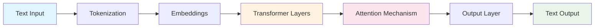
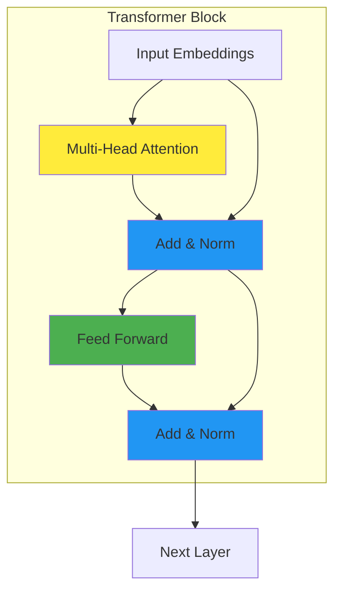
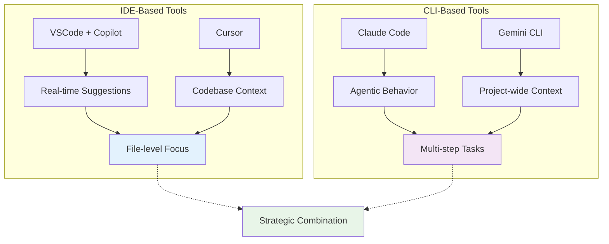
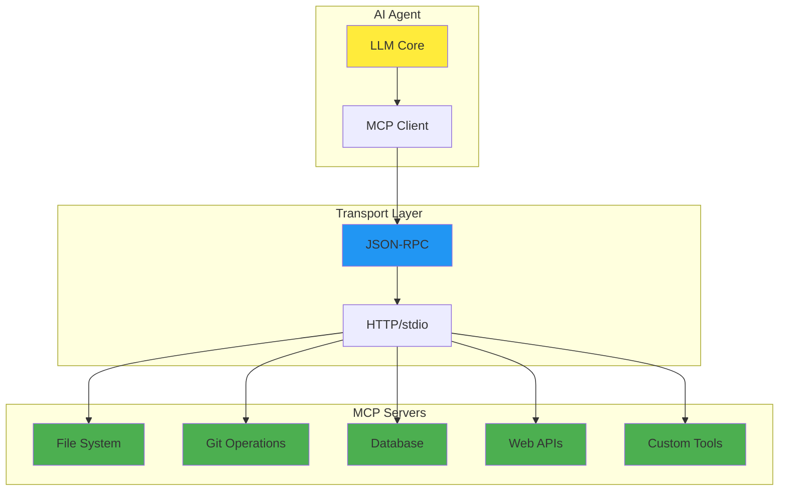
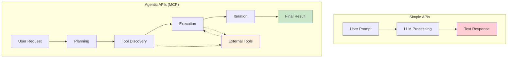
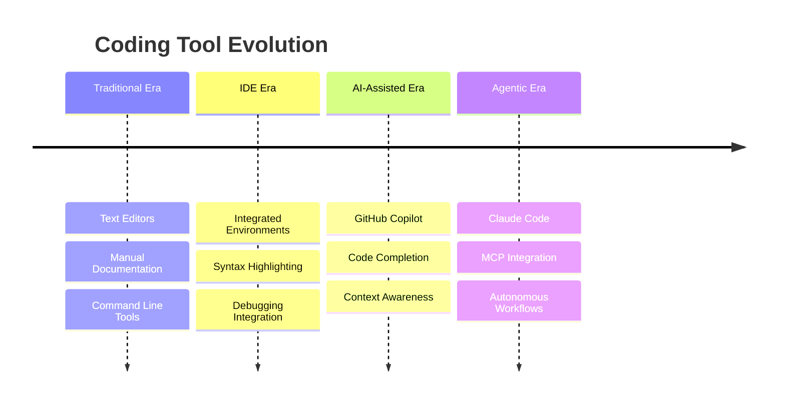
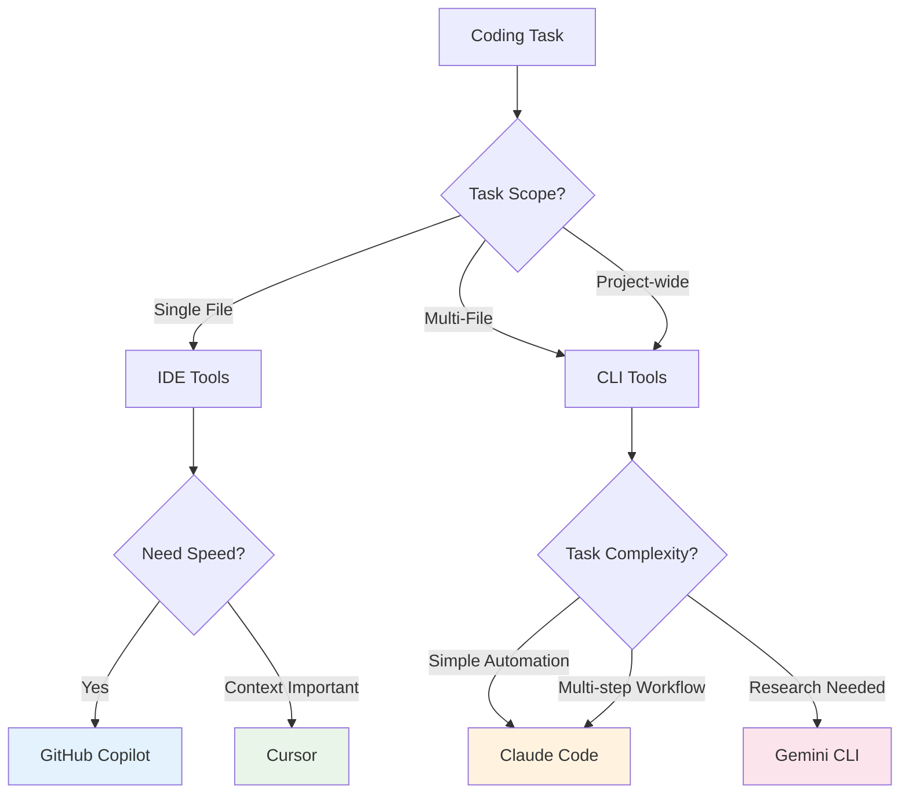
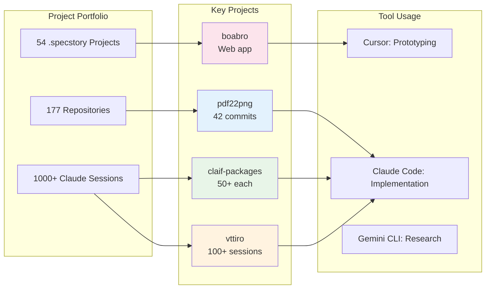
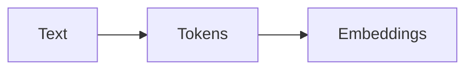
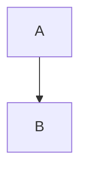

# this_file: src_slides/assets/visual-assets.md

# Visual Assets for Conference Talk

This document contains the Mermaid diagrams and visual specifications for the "Coding with LLMs" presentation.

## Mermaid Diagrams

### 1. LLM Processing Pipeline
**Topic:** Complete flow from text input to text output


### 2. Transformer Architecture Detail
**Topic:** Internal structure of transformer layers


### 3. IDE vs CLI Paradigm Comparison
**Topic:** Two different development approaches


### 4. MCP Architecture
**Topic:** Model Context Protocol ecosystem


### 5. Simple vs Agentic APIs
**Topic:** Evolution from completion to action


### 6. Development Workflow Evolution
**Topic:** Timeline of coding tool progression


### 7. Tool Selection Decision Tree
**Topic:** When to use which AI coding tool


### 8. Real Project Examples
**Topic:** Adam's portfolio project analysis


## Usage in Slides

Embed Mermaid diagrams in slides using:

```markdown

```

## Usage in Documentation

For MkDocs, Mermaid is supported through pymdownx.superfences:

```markdown

```

## Diagram Specifications

- **Format:** Mermaid syntax (text-based)
- **Rendering:** Native support in modern browsers and documentation tools
- **Style:** Clean, professional color schemes
- **Accessibility:** Screen reader compatible with proper alt text
- **Maintenance:** Version controlled and easily editable

## Color Scheme

- **Primary Blue:** #2196f3
- **Success Green:** #4caf50
- **Warning Orange:** #ff9800
- **Accent Purple:** #9c27b0
- **Light Backgrounds:** #f5f5f5
- **Text:** #333333

## Alternative Formats

If Mermaid needs alternatives:

1. **PlantUML** - For complex UML diagrams
2. **Graphviz/DOT** - For network diagrams
3. **D3.js** - For interactive visualizations
4. **Custom SVG** - For precise technical illustrations

## Accessibility

All images should include:
- Descriptive alt text
- High contrast for visibility
- Clear labeling of components
- Support for screen readers