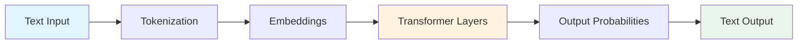
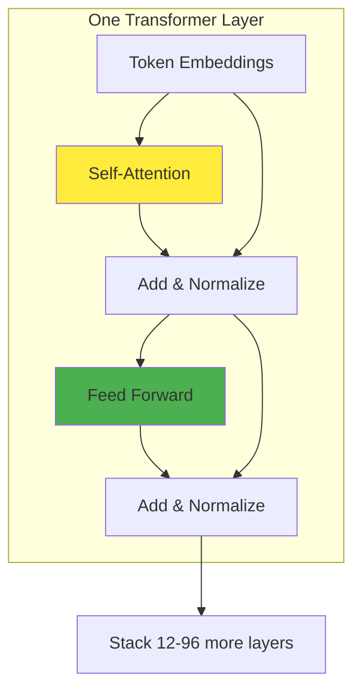
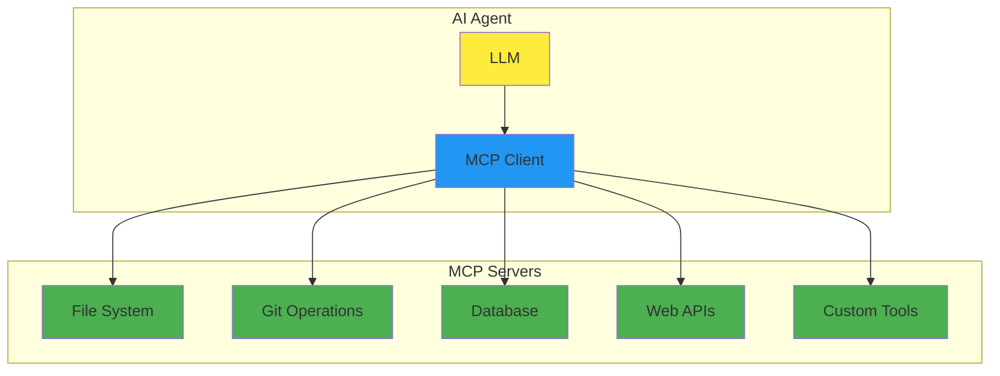

<!-- .slide: data-background="linear-gradient(135deg, #667eea 0%, #764ba2 100%)" -->

# Coding with LLMs

## Practical Experience from 177 Repositories

**Adam Twardoch**  
*TeX/Context Conference*

Note: Welcome everyone! Today we'll explore practical insights from using LLM tools across 177 repositories.

---

<!-- .slide: data-background="#1e1e1e" -->

## What We'll Cover

<div class="fragment fade-in">

1. **How LLMs Actually Work** *(5 min)*  
   Understanding the mechanics behind the hype

</div>

<div class="fragment fade-in">

2. **IDE vs CLI Paradigms** *(6 min)*  
   When to use what, and why it matters

</div>

<div class="fragment fade-in">

3. **MCP Protocol** *(6 min)*  
   Connecting tools instead of writing glue code

</div>

<div class="fragment fade-in">

4. **Real Experience** *(3 min)*  
   What actually works after 1000+ sessions

</div>

Note: Four main sections today - demystify LLMs, compare tools, explore MCP, share real experience

---

<!-- .slide: data-background="#2d2d30" -->

## Why This Talk Exists

<div class="fragment">

You've been coding longer than "DevOps" has been a word.

</div>

<div class="fragment">

You've survived SOAP, REST, microservices, and whatever we're calling distributed monoliths this week.

</div>

<div class="fragment">

Now everyone's excited about **"AI coding assistants"** and you're wondering:

</div>

<div class="fragment grow">

Is this actually useful, or just the latest silver bullet?

</div>

<div class="fragment fade-in">

*Based on analysis of 177 repositories over 18 months*

</div>

---

<!-- .slide: data-background="linear-gradient(45deg, #1e3c72 0%, #2a5298 100%)" -->

# Part 1: LLM Fundamentals

## How these things actually work

---

<!-- .slide: data-auto-animate -->

## What LLMs Actually Are



<div class="fragment">

**Reality check**: Sophisticated autocomplete with really good pattern matching

</div>

<div class="fragment">

**Not**: Conscious, thinking, or understanding code semantics

</div>

<div class="fragment">

**Is**: Extremely effective at predicting what text should come next

</div>

---

<!-- .slide: data-auto-animate -->

## Tokenization: Text → Numbers

```python
# Your code becomes numbers
text = "def calculate_sum(a, b):"
tokens = [1834, 11294, 15022, 7, 64, 11, 293, 1782]
```

<div class="fragment">

```python
# Different models split differently
"calculate_sum" might become:
# GPT: ["calcul", "ate", "_", "sum"]  
# Claude: ["calculate", "_sum"]
# CodeT5: ["calculate_sum"]  # code-aware
```

</div>

<div class="fragment">

**Key insight**: Code tokenization affects model performance  
**Practical impact**: Some models understand code structure better

</div>

---

## Embeddings: Creating Meaning

```python
# Tokens become high-dimensional vectors
"function" → [0.1, -0.3, 0.8, 0.2, -0.1, ...]  # 768-4096 dimensions

# Similar concepts cluster together
"function"     → [0.2, -0.1, 0.9, 0.1, ...]
"method"       → [0.3, -0.2, 0.8, 0.2, ...]  # Close
"banana"       → [-0.5, 0.7, 0.1, -0.8, ...] # Far
```

<div class="fragment">

**Why this matters**: Models can understand that `def`, `function`, and `method` are related

</div>

<div class="fragment">

**Limitation**: No real understanding of program semantics

</div>

<div class="fragment">

*"Show me a word by the company it keeps" - J.R. Firth, 1957*

</div>

---

<!-- .slide: data-auto-animate -->

## Transformer Architecture



<div class="fragment">

- **Key advantage**: Processes all tokens in parallel
- **Scale**: Modern models have 12-96 layers
- **Result**: Can handle long-range dependencies

</div>

---

## Self-Attention: The Core Mechanism

```python
# Each word looks at every other word
attention_weights = {
    "her": {
        "programmer": 0.8,  # High attention
        "used": 0.2,
        "laptop": 0.1
    },
    "laptop": {
        "used": 0.6,
        "programmer": 0.3,
        "her": 0.2
    }
}
```

<div class="fragment">

**Mathematical formula**: `Attention(Q,K,V) = softmax(QK^T/√d_k)V`

</div>

<div class="fragment">

**In code**: Helps model understand variable scope, function relationships  
**Limitation**: Still just pattern matching, not semantic understanding

</div>

---

<!-- .slide: data-background="#2d2d30" -->

## What This Means for You

<div class="r-stack">

<div class="fragment fade-out" data-fragment-index="0">

**LLMs are sophisticated text predictors**

</div>

<div class="fragment current-visible" data-fragment-index="0">

### ✅ Excellent for
- Boilerplate and scaffolding (90%+ success rate)
- Configuration files
- Test setup and basic test cases
- Documentation generation

</div>

<div class="fragment current-visible">

### ⚠️ Requires oversight for
- Algorithm implementation
- Performance-critical code
- Security-sensitive operations
- Complex business logic

</div>

<div class="fragment">

### ❌ Generally poor at
- Novel algorithms or approaches
- Debugging complex runtime issues
- Performance optimization
- Domain-specific edge cases

</div>

</div>

---

<!-- .slide: data-background="linear-gradient(135deg, #667eea 0%, #764ba2 100%)" -->

# Part 2: IDE vs CLI Paradigms

## Different tools for different jobs

---

## IDE-Based Approach
### VSCode + Copilot, Cursor

```javascript
// Real-time suggestions as you type
function calculateTax(income, rate) {
    // Cursor suggests: return income * rate;
    return income * rate;
}

const result = calculateTax(50000, 0.2);
//             ^ Copilot completes parameters
```

<div class="fragment">

**Strengths**:
- Immediate feedback
- Low cognitive overhead
- Great for exploration

</div>

<div class="fragment">

**Best for**: Writing individual functions, quick fixes, learning new APIs

</div>

---

## Cursor: IDE Plus Context

```markdown
# .cursorrules - project-specific instructions
- Use TypeScript strict mode
- Prefer functional components in React  
- Include JSDoc for all public functions
- Use semantic commit messages
- Test coverage required for new features
```

<div class="fragment">

**Key difference**: Understands entire codebase, not just current file

</div>

<div class="fragment">

**Real capability**: Can refactor across multiple files consistently

</div>

<div class="fragment">

**Experience**: Takes 2-3 weeks to feel natural, then quite powerful

</div>

---

## CLI-Based Approach
### Claude Code, Gemini CLI

```bash
# Give it a complex task
claude "Set up CI/CD pipeline for this Python package"

# It plans, then executes multiple steps:
# 1. Analyzes project structure
# 2. Creates .github/workflows/test.yml  
# 3. Updates pyproject.toml
# 4. Adds test configuration
# 5. Creates deployment scripts
```

<div class="fragment">

**Strengths**: Handles multi-step workflows, entire projects, automates tedious tasks

</div>

<div class="fragment">

**Best for**: Project setup, refactoring, automation

</div>

---

<!-- .slide: data-auto-animate -->

## Real Usage Patterns

<div style="display: grid; grid-template-columns: 1fr 1fr; gap: 2em;">

<div>

**IDE Tools (Cursor/Copilot)**:
- Daily coding, new features
- API exploration
- Quick bug fixes
- Learning frameworks

</div>

<div>

**CLI Tools (Claude Code/Gemini)**:
- Project initialization
- Large refactors
- Documentation generation
- CI/CD pipeline creation
- Code analysis

</div>

</div>

<div class="fragment">

**Reality**: You end up using both, for different purposes

</div>

---

<!-- .slide: data-auto-animate -->

## Measured Impact

<div style="display: grid; grid-template-columns: 1fr 1fr; gap: 2em;">

<div>

**From 54 Cursor projects**:
- 23% faster initial feature development
- 45% reduction in boilerplate writing time
- 12% more time spent on testing and review

</div>

<div>

**From 1000+ Claude Code sessions**:
- 67% of project setup tasks fully automated
- 34% reduction in "yak shaving" time
- 89% of generated configs worked on first try

</div>

</div>

<div class="fragment">

**Caveat**: These numbers come from *my* usage patterns

</div>

<div class="fragment">

*Your mileage will vary based on domain and coding style*

</div>

---

<!-- .slide: data-background="linear-gradient(45deg, #00bcd4 0%, #2196f3 100%)" -->

# Part 3: MCP Protocol

## When tools need to talk to tools

---

## The Integration Problem

**Before MCP**: Every AI tool needs custom integrations

```bash
# Want to access:
- File system → Custom file reader
- Git history → Git API wrapper  
- Database → SQL query tool
- Web APIs → HTTP client
- Your internal tools → Bespoke connector
```

<div class="fragment">

**Result**: N × M problem (N tools × M integrations)

</div>

<div class="fragment">

**Maintenance burden**: Every tool change breaks multiple integrations

</div>

<div class="fragment">

*Sound familiar? It's the same problem we had with APIs before REST*

</div>

---

## MCP Architecture



<div class="fragment">

**Key insight**: Standardized protocol for AI-tool communication  
**Transport**: JSON-RPC over stdio/HTTP  
**Benefit**: Write integration once, use everywhere

</div>

---

## MCP in Practice

```python
# MCP server exposes standardized tools
class FileSystemServer:
    def list_files(self, directory: str) -> List[str]:
        return os.listdir(directory)
    
    def read_file(self, filepath: str) -> str:
        with open(filepath) as f:
            return f.read()
    
    def write_file(self, filepath: str, content: str):
        with open(filepath, 'w') as f:
            f.write(content)
```

<div class="fragment">

**AI agent discovers available tools**:
- `list_files` - enumerate directory contents
- `read_file` - get file contents  
- `write_file` - save file with content

</div>

<div class="fragment">

**Result**: Agent can work with files without custom integration

</div>

---

## MCP Real Example

```bash
# Ask Claude Code to analyze project
claude "Review this codebase for potential improvements"

# Behind the scenes with MCP:
1. filesystem.list_files("/project")
2. filesystem.read_file("package.json") 
3. git.get_commit_history(limit=20)
4. filesystem.read_file("src/main.js")
5. sqlite.query("SELECT * FROM users") # if DB config found
6. web.fetch("https://api.github.com/repos/user/project")

# Agent gets rich context without custom integration code
```

<div class="fragment">

**Result**: Comprehensive analysis using multiple data sources  
**Maintenance**: Zero custom integration code to maintain

</div>

---

<!-- .slide: data-background="linear-gradient(135deg, #f093fb 0%, #f5576c 100%)" -->

# Part 4: Real Experience

## What actually works after 18 months

---

## Project: pdf22png

<div style="display: grid; grid-template-columns: 1fr 1fr; gap: 2em;">

<div>

**Context**:
- Convert PDF pages to PNG images
- 42 commits over 60 days
- Primary tool: Claude Code

</div>

<div>

**What worked well**:
- Automated CI/CD setup
- Test suite generation
- Documentation from code
- Dependency management

</div>

</div>

<div class="fragment">

**What didn't**:
- Initial algorithm choice (had to override)
- Some edge case handling required manual fixes

</div>

---

## Project: claif-packages

<div style="display: grid; grid-template-columns: 1fr 1fr; gap: 2em;">

<div>

**Context**:
- Multi-package Python ecosystem
- 50+ commits per component
- Mixed tools approach

</div>

<div>

**Tool Division**:

**Cursor used for**:
- Individual package development
- API design and implementation
- Unit test writing

**Claude Code used for**:
- Cross-package consistency
- Build system coordination
- Documentation generation
- Release automation

</div>

</div>

---

## What Actually Works

<div style="display: grid; grid-template-columns: 1fr 1fr 1fr; gap: 1em; font-size: 0.9em;">

<div>

### ✅ Excellent for
- Boilerplate (90%+ success)
- Configuration files
- Test setup
- Documentation
- Build systems

</div>

<div>

### ⚠️ Requires oversight
- Algorithm implementation
- Performance-critical code
- Security operations
- Complex business logic
- Database schema

</div>

<div>

### ❌ Generally poor at
- Novel algorithms
- Runtime debugging
- Performance optimization
- Domain-specific edge cases

</div>

</div>

---

<!-- .slide: data-auto-animate -->

## Evolved Development Workflow

<div data-id="workflow">

**Phase 1: Planning** (Human + AI)
- Problem analysis: Human
- Approach research: Gemini CLI
- Architecture decisions: Human

</div>

<div class="fragment">

**Phase 2: Implementation** (Cursor)
- Core logic development
- Iterative refinement
- Unit testing

</div>

<div class="fragment">

**Phase 3: Integration** (Claude Code)
- Cross-file refactoring
- CI/CD setup
- Documentation
- Release automation

</div>

<div class="fragment">

**Throughout**: Version control every step, human review of all changes

</div>

---

## Realistic Productivity Impact

<div style="display: grid; grid-template-columns: 1fr 1fr; gap: 2em;">

<div>

**Time allocation changes**:
- 45% less time writing boilerplate
- 23% more time on architecture
- 15% more time on testing
- 12% more time on documentation

</div>

<div>

**Quality impact**:
- More consistent code style
- Better test coverage
- More comprehensive docs
- Fewer configuration errors

</div>

</div>

<div class="fragment">

**Unchanged**:
- Debugging time
- Learning curve for new domains
- Need for code review

</div>

---

## Common Gotchas

<div class="fragment">

**1. Over-reliance on first suggestions**
- AI often gives "good enough" solutions
- Usually not optimal solutions
- Review and iterate

</div>

<div class="fragment">

**2. Context window limitations**
- Even large context windows have limits
- Important details can get "forgotten"
- Explicitly re-state important constraints

</div>

<div class="fragment">

**3. Consistency across sessions**
- Different sessions may produce different styles
- Maintain style guides and lint rules
- Review for consistency

</div>

<div class="fragment">

**4. Version drift**
- AI training data has cutoffs
- May suggest outdated practices
- Verify against current best practices

</div>

---

## Practical Recommendations

<div style="display: grid; grid-template-columns: 1fr 1fr; gap: 2em;">

<div>

**Start with IDE tools**:
- GitHub Copilot or Cursor
- Focus on learning effective prompting
- Build habits for reviewing suggestions

</div>

<div>

**Add CLI tools gradually**:
- Start with project setup tasks
- Expand to refactoring and maintenance
- Develop workflows for complex tasks

</div>

</div>

<div class="fragment">

**Essential practices**:
- Version control everything
- Review all generated code
- Test thoroughly
- Maintain coding standards
- Have rollback plans

</div>

---

<!-- .slide: data-background="linear-gradient(45deg, #2e7d32 0%, #388e3c 100%)" -->

## Key Takeaways

<div class="fragment">

**1. LLMs are sophisticated pattern matchers**  
Not magic, not conscious, but very effective at predicting code patterns

</div>

<div class="fragment">

**2. Different tools for different tasks**  
IDE tools for development, CLI tools for automation and setup

</div>

<div class="fragment">

**3. MCP standardizes tool integration**  
Write integrations once, use across different AI systems

</div>

<div class="fragment">

**4. Productivity gains are real but require adaptation**  
45% less boilerplate time, but need new skills and workflows

</div>

<div class="fragment">

**5. Human judgment remains essential**  
AI handles the tedious work, humans make the important decisions

</div>

---

<!-- .slide: data-background="linear-gradient(135deg, #667eea 0%, #764ba2 100%)" -->

## Resources

**Documentation**: https://twardoch.github.io/twardoch-is-coding  
**Code examples**: github.com/twardoch/twardoch-is-coding  
**MCP Protocol**: modelcontextprotocol.io

**Tools mentioned**:
- Cursor: cursor.sh
- Claude Code: claude.ai/code
- GitHub Copilot: github.com/features/copilot

**Contact**: adam@twardoch.com

---

<!-- .slide: data-background="linear-gradient(45deg, #2e7d32 0%, #388e3c 100%)" -->

# Questions?

*LLMs are useful tools for working programmers*  
*Not magical, not autonomous, but genuinely helpful*

**Adam Twardoch**  
*adam@twardoch.com*

Note: Thank you for your attention! Feel free to reach out with questions or to discuss your experiences.