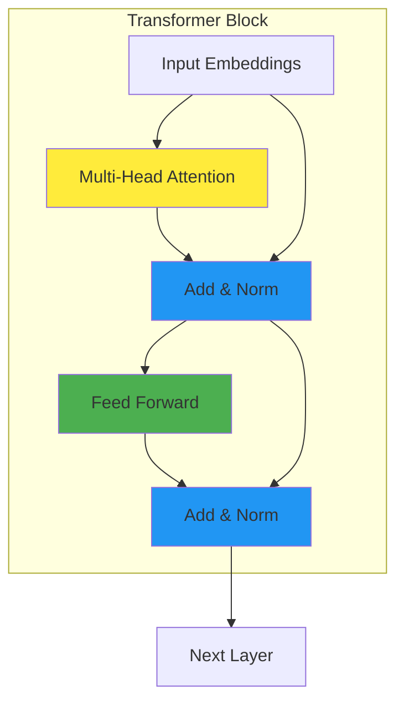
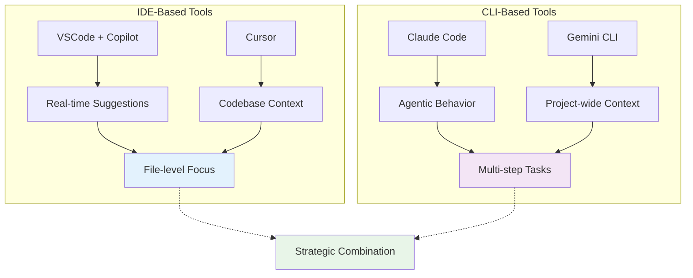
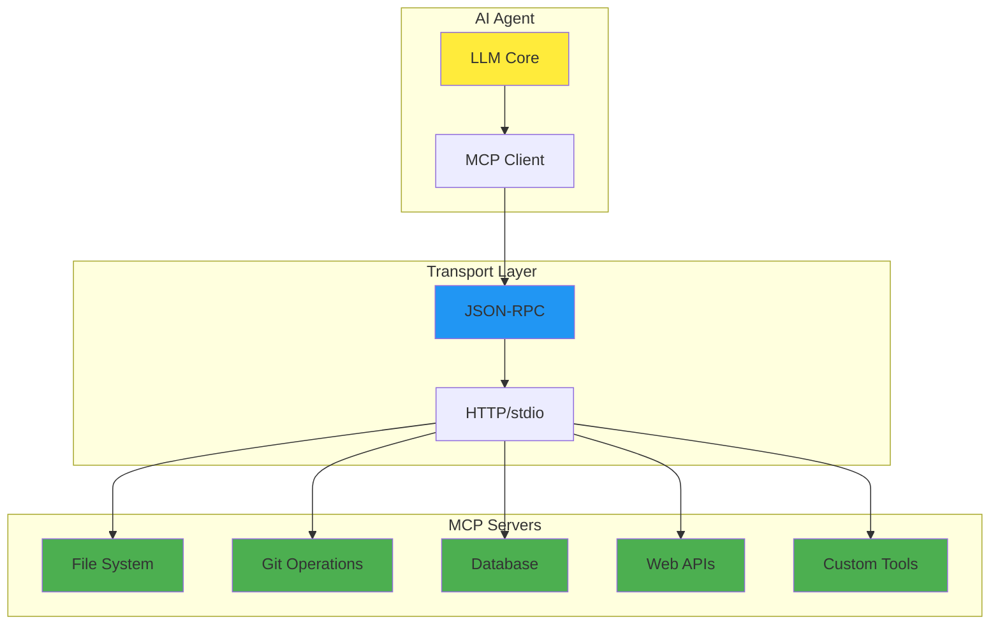
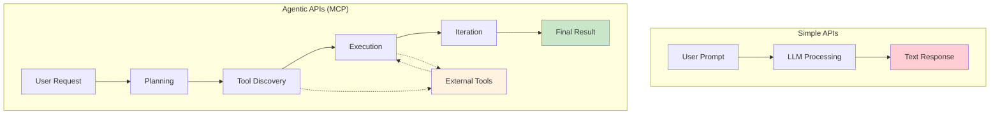
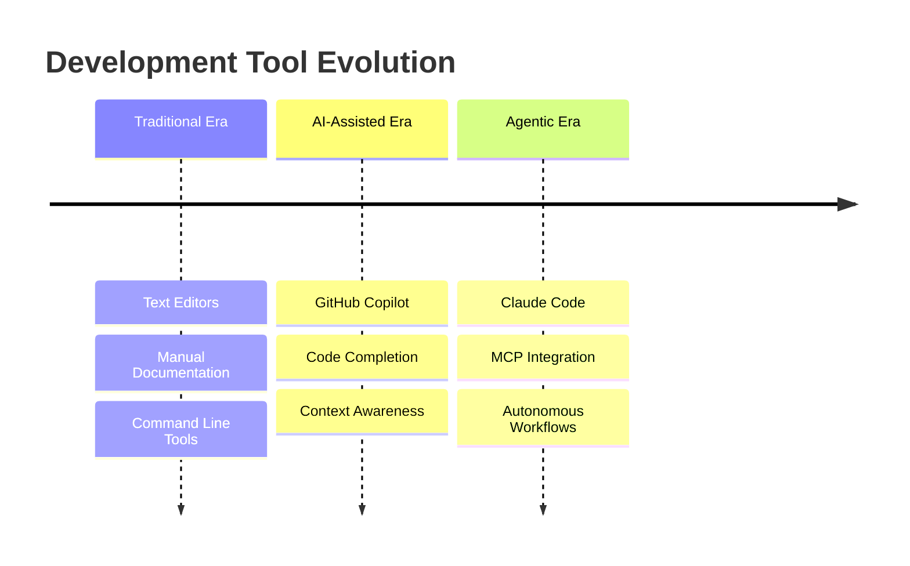

<!-- _class: title -->

# Coding with LLMs
## Tools and Techniques for Modern Development

**Adam Twardoch**  
*Conference Talk - 20 minutes*

---

<!-- _class: agenda -->

# Agenda

1. **How LLMs Actually Work** *(5 min)*
2. **IDE vs CLI: Two Paradigms** *(6 min)*  
3. **The MCP Revolution** *(6 min)*
4. **My Coding Journey with LLMs** *(3 min)*

*Focus: Practical insights for experienced developers*

---

<!-- _class: section-divider -->

# Section 1
## How LLMs Actually Work
*Making transformer architecture accessible*

---

<!-- _class: content -->

# The LLM Pipeline


**Core Flow:** Text → Numbers → Vectors → Processing → Text

*No magic, just sophisticated pattern matching*

---

<!-- _class: content -->

# 1. Tokenization
## Text → Numbers

```python
# Example tokenization
text = "The cat sat on the mat"
tokens = [1034, 717, 423, 891, 1034, 2341]

# Advanced example
code = "function calculateSum(a, b) { return a + b; }"
# → ["function", "calculate", "Sum", "(", "a", ",", ...)
```

- **Words/subwords** become unique integers
- **Vocabulary** maps tokens to IDs (~50K-100K tokens)
- **Foundation** for all neural processing
- **Code tokenization** preserves syntax structure

*Different models, different tokenization strategies*

---

<!-- _class: content -->

# 2. Embeddings
## Tokens → Vectors

```python
# Token 1034 ("the") becomes vector
embedding = [0.1, -0.3, 0.8, 0.2, ...]  # 768+ dimensions

# Similar concepts cluster together
"cat" → [0.2, -0.1, 0.9, ...]
"dog" → [0.3, -0.2, 0.8, ...]  # Close to "cat"
"car" → [-0.5, 0.7, 0.1, ...] # Far from "cat"
```

- **Semantic similarity** in vector space
- **Related concepts** have similar embeddings
- **Context-independent** base representation
- **Training learns** meaningful relationships

*"You shall know a word by the company it keeps"*

---

<!-- _class: content -->

# 3. Transformer Architecture
## The Processing Engine



- **Parallel processing** (vs sequential RNNs)
- **Layer stacking** for complexity
- **Feed-forward networks** refine representations
- **Self-attention** captures relationships

*Key insight: Processes all tokens simultaneously*

---

<!-- _class: content -->

# 4. Attention Mechanism
## Dynamic Context Weighting

```python
# Example: "The programmer used her laptop"
# "her" pays attention to "programmer" (0.8 weight)
# "laptop" pays attention to "used" (0.6 weight)
attention_weights = {
    "her": {"programmer": 0.8, "used": 0.3, "laptop": 0.1},
    "laptop": {"used": 0.6, "programmer": 0.4, "her": 0.2}
}
```

- Each token "**looks at**" all other tokens
- Computes **relevance scores** dynamically  
- **Weighted combination** creates context-aware output
- Enables **long-range dependencies**

*"The key to understanding context"*

---

<!-- _class: section-divider -->

# Section 2
## IDE vs CLI: Two Paradigms
*When and why to use different approaches*

---

<!-- _class: comparison -->

# IDE-Based Tools
## VSCode + GitHub Copilot, Cursor

**Strengths:**
- ✅ **Real-time** inline suggestions
- ✅ **Immediate** feedback loop
- ✅ **File-focused** context
- ✅ **Low learning curve**

**Use for:** Quick edits, exploration, prototyping

---

<!-- _class: comparison -->

# Cursor Advantages
## Beyond VSCode + Copilot

```markdown
# .cursorrules example
- Use TypeScript for all new files
- Follow React functional component patterns  
- Include JSDoc comments for functions
- Prefer const over let/var
- Use semantic CSS class names
```

- **Codebase-wide context** understanding
- **.cursorrules files** for project-specific guidance
- **Built-in AI chat** with project awareness
- **AI-powered refactoring** with multi-file scope

*"AI-first editor, not just AI-enhanced"*

---

<!-- _class: comparison -->

# CLI-Based Tools
## Claude Code, Gemini CLI

**Strengths:**
- ✅ **Project-wide** understanding
- ✅ **Agentic behavior** (plan → execute)
- ✅ **Automation** capabilities
- ✅ **MCP integration** for tools

**Use for:** Complex tasks, automation, scripting

---

<!-- _class: comparison-table -->

# IDE vs CLI Paradigms



---

<!-- _class: section-divider -->

# Section 3
## The MCP Revolution
*Beyond simple completion APIs*

---

<!-- _class: content -->

# MCP Architecture



*Universal protocol enabling true AI automation*

---

<!-- _class: comparison -->

# Simple vs Agentic APIs



---

<!-- _class: content -->

# MCP Server Examples

- **File System**: Read, write, search files
- **Git Operations**: Commit, branch, merge automation
- **Database Queries**: SQL execution and analysis
- **Web Scraping**: API calls and data extraction
- **Custom Business Logic**: Domain-specific tools

*Real automation, not just text generation*

---

<!-- _class: content -->

# MCP in Action

```bash
# Claude Code with MCP
claude "Analyze this codebase and suggest improvements"
# → Reads all files (file-system MCP server)
# → Runs static analysis tools (linting MCP server)
# → Executes tests (testing MCP server)
# → Queries git history (git MCP server)
# → Generates comprehensive report

# Real example from pdf22png project:
# - Analyzed 42 commits
# - Set up CI/CD pipeline  
# - Implemented automated testing
# - Generated documentation
```

*Autonomous execution with human oversight*

---

<!-- _class: section-divider -->

# Section 4
## My Coding Journey with LLMs
*Real-world experience and lessons*

---

<!-- _class: timeline -->

# Tool Evolution Timeline



*Progressive enhancement of development capabilities*

---

<!-- _class: case-studies -->

# Real Project Examples

## pdf22png
- **42 commits** in 60 days
- **CI/CD pipeline** implementation
- **Automated testing** setup
- *Tool: Claude Code for systematic automation*

## claif-packages  
- **Multi-package** Python ecosystem
- **50+ commits** per component
- **Comprehensive documentation**
- *Tool: Mixed approach, coordination via Claude Code*

## vttiro
- **100+ Claude Code sessions**
- **Video processing** automation
- **Complex domain logic** implementation
- *Tool: Heavy CLI usage for complexity management*

---

<!-- _class: lessons -->

# Key Lessons Learned

✅ **Combine tools strategically** - Cursor for rapid iteration, Claude Code for complex tasks  
✅ **Always review and test** AI-generated code - AI writes, humans verify  
✅ **Use version control** as safety net - Commit early, commit often  
✅ **Security considerations** remain critical - Never trust, always verify  
✅ **Start simple**, scale complexity gradually - MVP first, features later

**Real insight:** *From 177 repositories analysis*  
**54 projects** used Cursor, **1000+ sessions** with Claude Code

*AI amplifies capabilities, doesn't replace judgment*

---

<!-- _class: workflow -->

# Practical Workflow Example

## Feature Implementation: JWT Authentication

**Phase 1: Research** *(Gemini CLI)*
```bash
gemini "Compare JWT vs session auth for Node.js API"
```

**Phase 2: Prototype** *(Cursor)*  
- Create auth routes
- Test with sample data
- Iterate on user flow

**Phase 3: Production** *(Claude Code)*
```bash
claude "Implement secure JWT auth with refresh tokens"
# → Creates models, middleware, tests
# → Sets up proper error handling
# → Generates documentation
```

---

<!-- _class: conclusion -->

# Key Takeaways

1. **LLMs are pattern matchers**, not magic
2. **IDE and CLI tools complement** each other
3. **MCP enables true automation** beyond completion
4. **Strategic combination** maximizes effectiveness
5. **Human oversight** remains essential

---

<!-- _class: resources -->

# Resources & Next Steps

📚 **Documentation**: [twardoch.github.io/twardoch-is-coding](https://twardoch.github.io/twardoch-is-coding)  
🛠️ **Tools**: Claude Code, Cursor, Gemini CLI  
📧 **Contact**: adam@twardoch.com  
🐙 **Code**: [github.com/twardoch/twardoch-is-coding](https://github.com/twardoch/twardoch-is-coding)

---

<!-- _class: thank-you -->

# Thank You!
## Questions?

*"The future of coding is collaborative—*  
*human creativity + AI capabilities"*

**Adam Twardoch**  
*adam@twardoch.com*