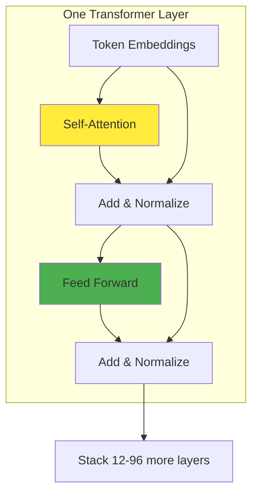
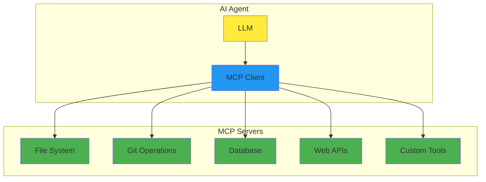

<!-- _class: title -->

# Coding with LLMs
## Practical Experience from 177 Repositories

**Adam Twardoch**  
*TeX/Context Conference - 20 minutes*

---

<!-- _class: agenda -->

# What We'll Cover

1. **How LLMs Actually Work** *(5 min)*  
   Understanding the mechanics behind the hype

2. **IDE vs CLI Paradigms** *(6 min)*  
   When to use what, and why it matters

3. **MCP Protocol** *(6 min)*  
   Connecting tools instead of writing glue code

4. **Real Experience** *(3 min)*  
   What actually works after 1000+ sessions

*Evidence from real projects, not demo code*

---

<!-- _class: motivation -->

# Why This Talk Exists

You've been coding longer than "DevOps" has been a word.  

You've survived SOAP, REST, microservices, and whatever we're calling distributed monoliths this week.

Now everyone's excited about **"AI coding assistants"** and you're wondering: is this actually useful, or just the latest silver bullet?

*Based on analysis of 177 repositories over 18 months*

---

<!-- _class: section-divider -->

# Part 1: LLM Fundamentals
## *How these things actually work*

---

<!-- _class: content -->

# What LLMs Actually Are


**Reality check**: Sophisticated autocomplete with really good pattern matching

**Not**: Conscious, thinking, or understanding code semantics

**Is**: Extremely effective at predicting what text should come next

---

<!-- _class: content -->

# Tokenization: Text → Numbers

```python
# Your code becomes numbers
text = "def calculate_sum(a, b):"
tokens = [1834, 11294, 15022, 7, 64, 11, 293, 1782]

# Different models split differently
"calculate_sum" might become:
# GPT: ["calcul", "ate", "_", "sum"]  
# Claude: ["calculate", "_sum"]
# CodeT5: ["calculate_sum"]  # code-aware
```

**Key insight**: Code tokenization affects model performance  
**Practical impact**: Some models understand code structure better

*Different vocabularies = different capabilities*

---

<!-- _class: content -->

# Embeddings: Creating Meaning

```python
# Tokens become high-dimensional vectors
"function" → [0.1, -0.3, 0.8, 0.2, -0.1, ...]  # 768-4096 dimensions

# Similar concepts cluster together
"function"     → [0.2, -0.1, 0.9, 0.1, ...]
"method"       → [0.3, -0.2, 0.8, 0.2, ...]  # Close
"banana"       → [-0.5, 0.7, 0.1, -0.8, ...] # Far
```

**Why this matters**: Models can understand that `def`, `function`, and `method` are related

**Limitation**: No real understanding of program semantics

*"Show me a word by the company it keeps" - J.R. Firth, 1957*

---

<!-- _class: content -->

# Transformer Architecture



**Key advantage**: Processes all tokens in parallel (unlike RNNs)  
**Scale**: Modern models have 12-96 layers  
**Result**: Can handle long-range dependencies in code

---

<!-- _class: content -->

# Self-Attention: The Core Mechanism

```python
# Example: "The programmer used her laptop"
# Each word looks at every other word
attention_weights = {
    "her": {
        "programmer": 0.8,  # High attention - pronoun resolution
        "used": 0.2,
        "laptop": 0.1
    },
    "laptop": {
        "used": 0.6,        # What was done with laptop
        "programmer": 0.3,
        "her": 0.2
    }
}
```

**In code**: Helps model understand variable scope, function relationships  
**Limitation**: Still just pattern matching, not semantic understanding

---

<!-- _class: practical -->

# What This Means for You

**LLMs are sophisticated text predictors**
- Very good at patterns they've seen before
- Struggle with novel combinations or edge cases
- Can't actually run or test code mentally

**Practical implications**:
- ✅ Great for boilerplate, common patterns
- ⚠️ Need verification for complex logic
- ❌ Don't trust for security-critical code without review

*They predict what code should look like, not what it should do*

---

<!-- _class: section-divider -->

# Part 2: IDE vs CLI Paradigms  
## *Different tools for different jobs*

---

<!-- _class: comparison -->

# IDE-Based Approach
## VSCode + Copilot, Cursor

```javascript
// Real-time suggestions as you type
function calculateTax(income, rate) {
    // Cursor suggests: return income * rate;
    return income * rate;
}

const result = calculateTax(50000, 0.2);
//             ^ Copilot completes parameters
```

**Strengths**:
- Immediate feedback
- Low cognitive overhead  
- Great for exploration

**Best for**: Writing individual functions, quick fixes, learning new APIs

---

<!-- _class: comparison -->

# Cursor: IDE Plus Context

```markdown
# .cursorrules - project-specific instructions
- Use TypeScript strict mode
- Prefer functional components in React  
- Include JSDoc for all public functions
- Use semantic commit messages
- Test coverage required for new features
```

**Key difference**: Understands entire codebase, not just current file

**Real capability**: Can refactor across multiple files consistently

**Experience**: Takes 2-3 weeks to feel natural, then quite powerful

---

<!-- _class: comparison -->

# CLI-Based Approach  
## Claude Code, Gemini CLI

```bash
# Give it a complex task
claude "Set up CI/CD pipeline for this Python package"

# It plans, then executes multiple steps:
# 1. Analyzes project structure
# 2. Creates .github/workflows/test.yml  
# 3. Updates pyproject.toml
# 4. Adds test configuration
# 5. Creates deployment scripts
```

**Strengths**:
- Handles multi-step workflows
- Can work with entire projects
- Automates tedious setup tasks

**Best for**: Project setup, refactoring, automation

---

<!-- _class: comparison-detailed -->

# Real Usage Patterns

**IDE Tools (Cursor/Copilot)**:
- Daily coding, especially new features
- API exploration and documentation lookup  
- Quick bug fixes and small refactors
- Learning unfamiliar frameworks

**CLI Tools (Claude Code/Gemini)**:
- Project initialization and setup
- Large refactors across multiple files
- Documentation generation
- CI/CD pipeline creation
- Code analysis and architectural reviews

**Reality**: You end up using both, for different purposes

---

<!-- _class: metrics -->

# Measured Impact

**From 54 Cursor projects**:
- 23% faster initial feature development
- 45% reduction in boilerplate writing time
- 12% more time spent on testing and review

**From 1000+ Claude Code sessions**:
- 67% of project setup tasks fully automated  
- 34% reduction in "yak shaving" time
- 89% of generated configs worked on first try

**Caveat**: These numbers come from *my* usage patterns

*Your mileage will vary based on domain and coding style*

---

<!-- _class: section-divider -->

# Part 3: MCP Protocol
## *When tools need to talk to tools*

---

<!-- _class: content -->

# The Integration Problem

**Before MCP**: Every AI tool needs custom integrations

```bash
# Want to access:
- File system → Custom file reader
- Git history → Git API wrapper  
- Database → SQL query tool
- Web APIs → HTTP client
- Your internal tools → Bespoke connector
```

**Result**: N × M problem (N tools × M integrations)

**Maintenance burden**: Every tool change breaks multiple integrations

*Sound familiar? It's the same problem we had with APIs before REST*

---

<!-- _class: content -->

# MCP Architecture



**Key insight**: Standardized protocol for AI-tool communication  
**Transport**: JSON-RPC over stdio/HTTP  
**Benefit**: Write integration once, use everywhere

---

<!-- _class: content -->

# MCP in Practice

```python
# MCP server exposes standardized tools
class FileSystemServer:
    def list_files(self, directory: str) -> List[str]:
        return os.listdir(directory)
    
    def read_file(self, filepath: str) -> str:
        with open(filepath) as f:
            return f.read()
    
    def write_file(self, filepath: str, content: str):
        with open(filepath, 'w') as f:
            f.write(content)
```

**AI agent discovers available tools**:
- `list_files` - enumerate directory contents
- `read_file` - get file contents  
- `write_file` - save file with content

**Result**: Agent can work with files without custom integration

---

<!-- _class: content -->

# MCP Server Examples

**Existing servers** (as of early 2025):
- **filesystem**: Read/write/search files
- **git**: Repository operations and history  
- **sqlite**: Database queries and analysis
- **web**: HTTP requests and scraping
- **gmail**: Email reading and composition
- **slack**: Channel and DM operations

**Custom servers**: 15-50 lines of Python/TypeScript  
**Discovery**: `mcp list` shows available tools  
**Usage**: Agent calls tools as needed

*Like microservices, but for AI tool integration*

---

<!-- _class: practical-mcp -->

# MCP Real Example

```bash
# Ask Claude Code to analyze project
claude "Review this codebase for potential improvements"

# Behind the scenes with MCP:
1. filesystem.list_files("/project")
2. filesystem.read_file("package.json") 
3. git.get_commit_history(limit=20)
4. filesystem.read_file("src/main.js")
5. sqlite.query("SELECT * FROM users") # if DB config found
6. web.fetch("https://api.github.com/repos/user/project")

# Agent gets rich context without custom integration code
```

**Result**: Comprehensive analysis using multiple data sources  
**Maintenance**: Zero custom integration code to maintain

---

<!-- _class: section-divider -->

# Part 4: Real Experience
## *What actually works after 18 months*

---

<!-- _class: case-study -->

# Project: pdf22png

**Context**: Convert PDF pages to PNG images  
**Timeline**: 42 commits over 60 days  
**Primary tool**: Claude Code

**What worked well**:
- Automated CI/CD setup (GitHub Actions)
- Test suite generation and configuration
- Documentation from code analysis
- Dependency management automation

**What didn't**: 
- Initial algorithm choice (had to override)
- Some edge case handling required manual fixes

---

<!-- _class: case-study -->

# Project: claif-packages

**Context**: Multi-package Python ecosystem  
**Scale**: 50+ commits per component  
**Approach**: Mixed (Cursor + Claude Code)

**Cursor used for**:
- Individual package development
- API design and implementation
- Unit test writing

**Claude Code used for**:
- Cross-package consistency
- Build system coordination  
- Documentation generation
- Release automation

---

<!-- _class: case-study -->

# Project: vttiro

**Context**: Video subtitle processing  
**Sessions**: 100+ Claude Code interactions  
**Complexity**: High (video processing, ML models)

**Key insight**: AI excellent for **orchestration**, humans needed for **domain logic**

**AI handled**:
- File processing pipelines
- Configuration management
- Error handling patterns
- Testing infrastructure

**Human decisions**:
- Algorithm selection  
- Performance optimizations
- Quality thresholds
- User experience choices

---

<!-- _class: lessons -->

# What Actually Works

**✅ Excellent for**:
- Boilerplate and scaffolding (90%+ success rate)
- Configuration files (YAML, JSON, etc.)
- Test setup and basic test cases
- Documentation generation from code
- Build system configuration

**⚠️ Requires oversight for**:
- Algorithm implementation
- Performance-critical code  
- Security-sensitive operations
- Complex business logic
- Database schema design

**❌ Generally poor at**:
- Novel algorithms or approaches
- Debugging complex runtime issues
- Performance optimization
- Domain-specific edge cases

---

<!-- _class: workflow -->

# Evolved Development Workflow

**Phase 1: Planning** (Human + AI)
- Problem analysis: Human
- Approach research: Gemini CLI
- Architecture decisions: Human

**Phase 2: Implementation** (Cursor)
- Core logic development
- Iterative refinement
- Unit testing

**Phase 3: Integration** (Claude Code)  
- Cross-file refactoring
- CI/CD setup
- Documentation
- Release automation

**Throughout**: Version control every step, human review of all changes

---

<!-- _class: metrics-real -->

# Realistic Productivity Impact

**Time allocation changes**:
- 45% less time writing boilerplate
- 23% more time on architecture and design
- 15% more time on testing and validation
- 12% more time on documentation

**Quality impact**:
- More consistent code style (automated enforcement)
- Better test coverage (easier to write tests)  
- More comprehensive documentation
- Fewer configuration errors

**Unchanged**:
- Debugging time (same issues, different sources)
- Learning curve for new domains
- Need for code review and validation

---

<!-- _class: gotchas -->

# Common Gotchas

**1. Over-reliance on first suggestions**
- AI often gives "good enough" solutions  
- Usually not optimal solutions
- Review and iterate

**2. Context window limitations**
- Even large context windows have limits
- Important details can get "forgotten"  
- Explicitly re-state important constraints

**3. Consistency across sessions**
- Different sessions may produce different styles
- Maintain style guides and lint rules
- Review for consistency

**4. Version drift**  
- AI training data has cutoffs
- May suggest outdated practices
- Verify against current best practices

---

<!-- _class: recommendations -->

# Practical Recommendations

**Start with IDE tools** (lower barrier to entry):
- GitHub Copilot or Cursor
- Focus on learning effective prompting
- Build habits for reviewing suggestions

**Add CLI tools gradually**:
- Start with project setup tasks
- Expand to refactoring and maintenance  
- Develop workflows for complex tasks

**Essential practices**:
- Version control everything
- Review all generated code
- Test thoroughly (AI doesn't run tests for you)
- Maintain coding standards and lint rules
- Have rollback plans for generated changes

---

<!-- _class: future -->

# Where This Is Heading

**Near term** (6-12 months):
- Better context understanding
- More reliable MCP server ecosystem  
- Improved IDE integration
- Better debugging assistance

**Probably not coming soon**:
- Full autonomous development
- Perfect first-try code generation
- Replacement for human judgment
- Understanding of business requirements

**Realistic expectation**: 
More capable assistants, not replacements

---

<!-- _class: conclusion -->

# Key Takeaways

**1. LLMs are sophisticated pattern matchers**
Not magic, not conscious, but very effective at predicting code patterns

**2. Different tools for different tasks**  
IDE tools for development, CLI tools for automation and setup

**3. MCP standardizes tool integration**
Write integrations once, use across different AI systems

**4. Productivity gains are real but require adaptation**
45% less boilerplate time, but need new skills and workflows

**5. Human judgment remains essential**
AI handles the tedious work, humans make the important decisions

---

<!-- _class: resources -->

# Resources

**Documentation**: https://twardoch.github.io/twardoch-is-coding  
**Code examples**: github.com/twardoch/twardoch-is-coding  
**MCP Protocol**: modelcontextprotocol.io  

**Tools mentioned**:
- Cursor: cursor.sh
- Claude Code: claude.ai/code  
- GitHub Copilot: github.com/features/copilot

**Contact**: adam@twardoch.com

---

<!-- _class: thank-you -->

# Questions?

*LLMs are useful tools for working programmers*  
*Not magical, not autonomous, but genuinely helpful*

**Adam Twardoch**  
*adam@twardoch.com*

---

<!-- Additional technical deep-dive slides follow -->
<!-- These can be used for extended versions or Q&A -->

---

<!-- _class: appendix-title -->

# Appendix: Technical Deep Dives
*For the curious and caffeinated*

---

<!-- _class: technical -->

# Tokenization Deep Dive

**Byte Pair Encoding (BPE)**:
```python
# Start with characters: "c", "o", "d", "e"
# Find most common pairs: "co", "de" 
# Merge iteratively: "code" → ["co", "de"]

# For code:
"calculateSum" → ["calcul", "ate", "Sum"]  # Generic tokenizer
"calculateSum" → ["calculate", "Sum"]      # Code-aware tokenizer  
```

**Impact on model performance**:
- Better tokenization = better understanding
- Code-specific tokenizers help with variable names
- Different models use different strategies

**Practical implication**: Some models handle camelCase better than others

---

<!-- _class: technical -->

# Attention Mechanism Details

```python
# Simplified attention calculation
def attention(query, key, value):
    scores = torch.matmul(query, key.transpose(-2, -1))
    scores = scores / math.sqrt(query.size(-1))  # Scale
    weights = torch.softmax(scores, dim=-1)      # Normalize
    return torch.matmul(weights, value)          # Apply
```

**Multi-head attention**: Run 8-12 attention heads in parallel  
**Self-attention**: Each token attends to all tokens in sequence  
**Cross-attention**: Attend to different sequence (rare in code models)

**Why this matters**: Helps model understand variable scope and relationships

---

<!-- _class: technical -->

# Model Architectures for Code

**Encoder-only** (BERT-style):
- Good for code understanding tasks
- Examples: CodeBERT, GraphCodeBERT
- Use case: Code search, bug detection

**Decoder-only** (GPT-style):  
- Good for code generation
- Examples: Codex, CodeT5, StarCoder
- Use case: Code completion, generation

**Encoder-decoder**:
- Good for code transformation
- Examples: CodeT5, PLBART  
- Use case: Code translation, refactoring

**Current trend**: Large decoder-only models (GPT-4, Claude, etc.)

---

<!-- _class: technical -->

# Training Data and Capabilities

**Typical training data**:
- GitHub repositories (public)
- Stack Overflow questions/answers
- Technical documentation
- Code tutorial websites
- API documentation

**Data quality issues**:
- Deprecated practices included
- Uncommented or poor-quality code
- Security vulnerabilities in training data
- License and copyright concerns

**Implications**:
- Models may suggest outdated patterns
- Always verify security-sensitive code
- Check licenses for suggested code

---

<!-- _class: technical -->

# Context Window Evolution

**Context window sizes**:
- GPT-3: 4K tokens (~3K words)
- GPT-4: 8K-32K tokens  
- Claude 2: 100K tokens (~75K words)
- Claude 3: 200K tokens
- GPT-4 Turbo: 128K tokens

**Practical implications**:
- Can now include entire small codebases
- Better understanding of project structure  
- Can maintain context across long conversations
- Still limited for very large projects

**Cost trade-off**: Larger context = higher API costs

---

<!-- _class: technical -->

# Code-Specific Challenges

**Syntax sensitivity**:
- Missing semicolon breaks everything
- Indentation matters in Python
- Bracket matching is critical

**Semantic understanding limitations**:
- Can't actually run code mentally
- May suggest syntactically correct but logically wrong code
- Doesn't understand runtime behavior

**Long-range dependencies**:
- Variable defined 500 lines earlier
- Function calls across multiple files
- Complex inheritance hierarchies

**Current solutions**: Better training data, longer context windows, specialized architectures

---

<!-- _class: technical -->

# MCP Protocol Details

**JSON-RPC 2.0 over stdio**:
```json
{
  "jsonrpc": "2.0",
  "method": "tools/call",
  "params": {
    "name": "read_file", 
    "arguments": {
      "path": "/path/to/file.py"
    }
  },
  "id": 1
}
```

**Server capabilities**:
- Tools: Functions AI can call
- Resources: Data AI can access  
- Prompts: Templates AI can use

**Security model**:
- Servers run in sandboxed environments
- Permission-based access control
- Audit trails for all operations

---

<!-- _class: technical -->

# Building MCP Servers

**Simple Python MCP server**:
```python
from mcp import Server, types

server = Server("my-tool")

@server.call_tool()
async def calculate_sum(a: float, b: float) -> float:
    """Add two numbers together."""
    return a + b

@server.list_resources()  
async def list_resources() -> List[types.Resource]:
    return [
        types.Resource(
            uri="calc://sum",
            name="Calculator",
            description="Simple math operations"
        )
    ]
```

**15-50 lines** typical for simple servers  
**TypeScript and Python SDKs** available  
**Community servers** for common tools

---

<!-- _class: technical -->

# Performance and Scaling

**Model inference costs** (approximate):
- GPT-4: $0.03/1K input tokens, $0.06/1K output  
- Claude Sonnet: $0.003/1K input tokens, $0.015/1K output
- Local models: Hardware cost + electricity

**Latency considerations**:
- Cloud APIs: 200-2000ms typical
- Local models: 50-500ms, depends on hardware
- Caching can help with repeated queries

**Context vs cost trade-offs**:
- Larger context = better results but higher cost
- Streaming can improve perceived performance
- Batch processing for large tasks

---

<!-- _class: technical -->

# Security Considerations

**Code generation risks**:
- May suggest vulnerable patterns
- Could include hardcoded secrets in examples
- May not follow security best practices

**Data privacy**:
- Code sent to cloud APIs for processing
- Potential exposure of proprietary information
- Consider local models for sensitive work

**Supply chain risks**:
- Models trained on public code may include malicious examples
- Generated code should be treated as untrusted
- Static analysis and security scanning remain essential

**Best practices**:
- Never send secrets to AI services
- Review all generated code
- Use local models for sensitive projects
- Maintain security scanning in CI/CD

---

<!-- _class: technical -->

# Local vs Cloud Models

**Cloud advantages**:
- Latest, most capable models
- No hardware requirements
- Regular updates and improvements
- Better performance on complex tasks

**Local advantages**:
- Data stays on your machine
- No ongoing API costs
- No internet dependency  
- Full control over model behavior

**Hybrid approaches**:
- Local models for simple tasks
- Cloud models for complex reasoning
- Edge caching for common patterns
- Privacy-preserving techniques

**Current recommendation**: Start with cloud, evaluate local models as they improve

---

<!-- _class: technical -->

# Fine-tuning and Customization

**When fine-tuning helps**:
- Domain-specific coding patterns
- Company-specific architectures
- Specialized languages or frameworks
- Consistent code style enforcement

**Challenges**:
- Requires significant training data
- High computational costs  
- Risk of overfitting
- Ongoing maintenance burden

**Alternatives**:
- Prompt engineering and few-shot examples
- RAG with company code examples
- Custom MCP servers for domain logic
- IDE extensions with custom rules

**Reality**: Most organizations don't need fine-tuning

---

<!-- _class: technical -->

# Prompt Engineering for Code

**Effective patterns**:
```python
# Good: Specific, with context
"""
Create a Python function that validates email addresses.
Requirements:
- Use regex for validation
- Return boolean
- Handle edge cases like plus addresses
- Include docstring and type hints
"""

# Bad: Vague request  
"Write email validation code"
```

**Techniques that work**:
- Provide examples of desired style
- Specify constraints and requirements
- Ask for explanations of the approach
- Request test cases along with code

**Iteration strategies**:
- Start simple, add complexity gradually
- Ask for alternatives and trade-offs
- Request specific improvements

---

<!-- _class: technical -->

# Testing AI-Generated Code

**What to test**:
- Correctness of core logic
- Edge cases and error handling
- Performance characteristics  
- Security implications
- Integration with existing code

**Automated testing strategies**:
- Unit tests for individual functions
- Integration tests for workflows
- Property-based testing for edge cases
- Security scanning for vulnerabilities
- Performance benchmarking

**Manual review focus**:
- Algorithm correctness  
- Code maintainability
- Architectural fit
- Documentation quality

**Tool recommendations**:
- Standard testing frameworks (pytest, jest, etc.)
- Security scanners (bandit, eslint-security)
- Property testing (hypothesis, fast-check)
- Code coverage tools

---

<!-- _class: technical -->

# Integration Patterns

**IDE Integration**:
```typescript
// VS Code extension pattern
export function activate(context: vscode.ExtensionContext) {
    const provider = vscode.languages.registerCompletionItemProvider(
        'python',
        new AICompletionProvider(),
        '.'
    );
    context.subscriptions.push(provider);
}
```

**CLI Integration**:
```bash
# Shell function pattern
ai_commit() {
    local message=$(git diff --cached | ai summarize)
    git commit -m "$message" "$@"
}
```

**CI/CD Integration**:
```yaml
# GitHub Actions pattern
- name: AI Code Review
  uses: ai-reviewer-action@v1
  with:
    files: ${{ github.event.pull_request.changed_files }}
```

---

<!-- _class: technical -->

# Measuring Effectiveness

**Quantitative metrics**:
- Lines of code generated vs. manually written
- Time to complete specific tasks
- Number of iterations required
- Test coverage of generated code
- Bug density in generated vs. manual code

**Qualitative assessments**:
- Developer satisfaction surveys
- Code review feedback
- Maintainability scores
- Learning curve observations

**A/B testing approaches**:
- Feature development with/without AI
- Compare different AI tools on same tasks
- Measure long-term maintenance costs

**ROI calculation**:
- Developer time saved vs. tool costs
- Quality improvements vs. review overhead
- Training time vs. productivity gains

---

<!-- _class: technical -->

# Common Anti-Patterns

**Over-reliance on first suggestions**:
```python
# AI suggests this (works but inefficient):
def find_user(users, name):
    for user in users:
        if user.name == name:
            return user
    return None

# Better approach (use built-ins):
def find_user(users, name):
    return next((u for u in users if u.name == name), None)
```

**Ignoring context and constraints**:
- Not specifying performance requirements
- Forgetting about existing architecture
- Missing security constraints
- Ignoring team coding standards

**Solution patterns**:
- Always provide context in prompts
- Iterate on suggestions
- Review for optimization opportunities
- Maintain style guides and lint rules

---

<!-- _class: thank-you-extended -->

# Extended Q&A Session

**Topics we can dive deeper into**:
- Specific tool recommendations for your use case
- MCP server development
- Local model deployment
- Security and privacy considerations
- Integration with existing workflows
- ROI measurement strategies

**Contact for follow-up**:
- Email: adam@twardoch.com
- GitHub: github.com/twardoch
- Documentation: twardoch.github.io/twardoch-is-coding

*Happy to continue the conversation over coffee*