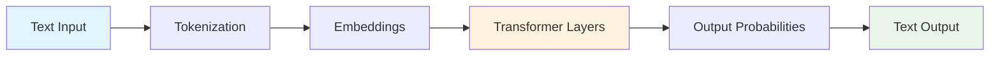
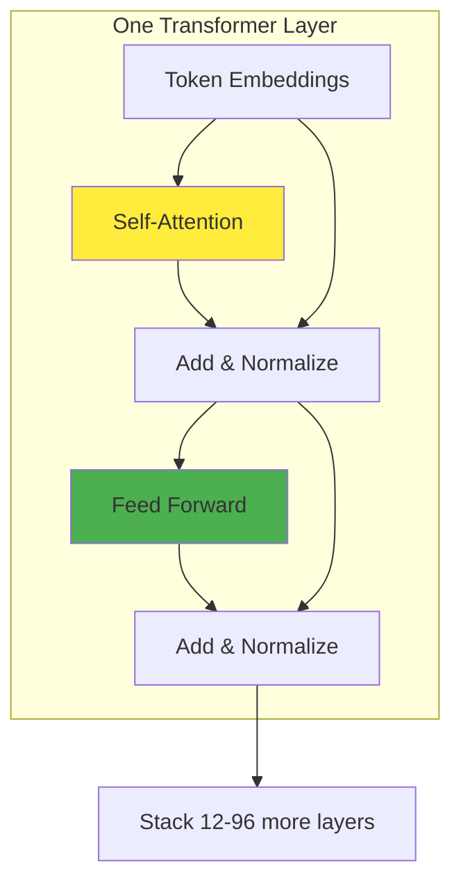
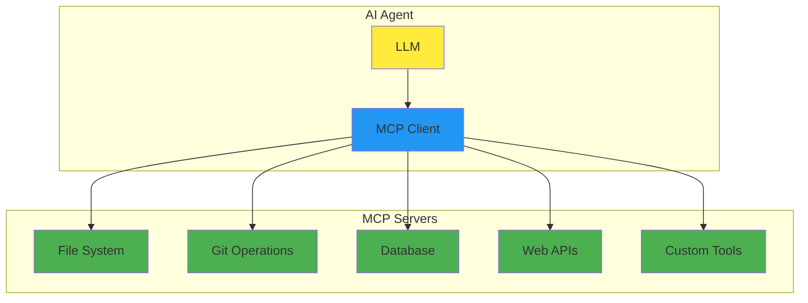

# Coding with LLMs

## Practical Experience from 177 Repositories

<div class="pt-12">
  <span @click="$slidev.nav.next" class="px-2 py-1 rounded cursor-pointer" hover="bg-white bg-opacity-10">
    Press Space to continue <carbon:arrow-right class="inline"/>
  </span>
</div>

<div class="abs-br m-6 flex gap-2">
  <button @click="$slidev.nav.openInEditor()" title="Open in Editor" class="text-xl slidev-icon-btn opacity-50 !border-none !hover:text-white">
    <carbon:edit />
  </button>
  <a href="https://github.com/twardoch/twardoch-is-coding" target="_blank" alt="GitHub"
    class="text-xl slidev-icon-btn opacity-50 !border-none !hover:text-white">
    <carbon-logo-github />
  </a>
</div>

<!--
Welcome everyone! Today we'll explore practical insights from using LLM tools across 177 repositories.
This isn't about hype - it's about what actually works.
-->

---
transition: fade-out
layout: default
---

# What We'll Cover

<v-clicks>

<div class="grid grid-cols-2 gap-8">

<div>

## 🧠 How LLMs Work
Understanding the mechanics behind the hype

## 💻 IDE vs CLI
When to use what, and why it matters

</div>

<div>

## 🔌 MCP Protocol
Connecting tools instead of writing glue code

## 📊 Real Experience
What actually works after 1000+ sessions

</div>

</div>

</v-clicks>

<style>
h2 {
  @apply text-2xl font-bold mt-4 mb-2;
}
</style>

<!--
Four main sections today:
1. Demystify how LLMs actually work
2. Compare different tool paradigms
3. Explore the MCP protocol for tool integration
4. Share real-world experience and metrics
-->

---
layout: intro
---

# Why This Talk Exists

<div class="text-xl opacity-80">

You've been coding longer than "DevOps" has been a word.

You've survived SOAP, REST, microservices, and whatever we're calling distributed monoliths this week.

Now everyone's excited about **"AI coding assistants"** and you're wondering:

</div>

<div v-click class="mt-8 text-2xl font-bold text-center">
Is this actually useful, or just the latest silver bullet?
</div>

<div v-click class="mt-8 text-center opacity-60">
*Based on analysis of 177 repositories over 18 months*
</div>

---
layout: section
---

# Part 1: LLM Fundamentals
## How these things actually work

---
layout: two-cols
---

# What LLMs Actually Are

<v-clicks>

- **Reality check**: Sophisticated autocomplete with really good pattern matching

- **Not**: Conscious, thinking, or understanding code semantics

- **Is**: Extremely effective at predicting what text should come next

</v-clicks>

::right::



<v-click>

<div class="mt-8 text-sm opacity-80">
The entire process is deterministic matrix multiplication - no magic involved
</div>

</v-click>

---
layout: default
---

# Tokenization: Text → Numbers

<div class="grid grid-cols-2 gap-4">

<div>

```python
# Your code becomes numbers
text = "def calculate_sum(a, b):"
tokens = [1834, 11294, 15022, 7, 64, 11, 293, 1782]
```

</div>

<div v-click>

```python
# Different models split differently
"calculate_sum" might become:
# GPT: ["calcul", "ate", "_", "sum"]  
# Claude: ["calculate", "_sum"]
# CodeT5: ["calculate_sum"]  # code-aware
```

</div>

</div>

<v-clicks>

<div class="mt-8">

**Key insight**: Code tokenization affects model performance

**Practical impact**: Some models understand code structure better

</div>

<div class="mt-4 text-sm opacity-60">
*Different vocabularies = different capabilities*
</div>

</v-clicks>

---
layout: default
---

# Embeddings: Creating Meaning

```python {all|1-2|4-7|all}
# Tokens become high-dimensional vectors
"function" → [0.1, -0.3, 0.8, 0.2, -0.1, ...]  # 768-4096 dimensions

# Similar concepts cluster together
"function"     → [0.2, -0.1, 0.9, 0.1, ...]
"method"       → [0.3, -0.2, 0.8, 0.2, ...]  # Close
"banana"       → [-0.5, 0.7, 0.1, -0.8, ...] # Far
```

<v-clicks>

<div class="mt-8">

**Why this matters**: Models can understand that `def`, `function`, and `method` are related

**Limitation**: No real understanding of program semantics

</div>

<div class="mt-4 text-sm opacity-60">
*"Show me a word by the company it keeps" - J.R. Firth, 1957*
</div>

</v-clicks>

---
layout: center
---

# Transformer Architecture

<div class="grid grid-cols-2 gap-8">

<div>



</div>

<div>

<v-clicks>

- **Key advantage**: Processes all tokens in parallel
- **Scale**: Modern models have 12-96 layers
- **Result**: Can handle long-range dependencies

</v-clicks>

</div>

</div>

---
layout: default
---

# Self-Attention: The Core Mechanism

<div class="grid grid-cols-2 gap-4">

<div>

```python
# Each word looks at every other word
attention_weights = {
    "her": {
        "programmer": 0.8,  # High attention
        "used": 0.2,
        "laptop": 0.1
    },
    "laptop": {
        "used": 0.6,
        "programmer": 0.3,
        "her": 0.2
    }
}
```

</div>

<div v-click>

## Mathematical Formula

$$\text{Attention}(Q,K,V) = \text{softmax}\left(\frac{QK^T}{\sqrt{d_k}}\right)V$$

<div class="mt-4 text-sm">

- **Q**: Query (what we're looking for)
- **K**: Key (what we compare against)
- **V**: Value (what we retrieve)

</div>

</div>

</div>

---
layout: fact
---

# What This Means for You

<div class="text-xl">

LLMs are sophisticated text predictors

</div>

<div class="grid grid-cols-3 gap-4 mt-8">

<div v-click>

### ✅ Great for
- Boilerplate
- Common patterns
- Documentation

</div>

<div v-click>

### ⚠️ Need oversight
- Complex logic
- Performance code
- Business rules

</div>

<div v-click>

### ❌ Poor at
- Novel algorithms
- Runtime debugging
- Edge cases

</div>

</div>

<div v-click class="mt-8 text-center opacity-60">
*They predict what code should look like, not what it should do*
</div>

---
layout: section
---

# Part 2: IDE vs CLI Paradigms
## Different tools for different jobs

---
layout: two-cols
---

# IDE-Based Approach
## VSCode + Copilot, Cursor

```javascript
// Real-time suggestions as you type
function calculateTax(income, rate) {
    // Cursor suggests: return income * rate;
    return income * rate;
}

const result = calculateTax(50000, 0.2);
//             ^ Copilot completes parameters
```

::right::

<v-clicks>

### Strengths
- Immediate feedback
- Low cognitive overhead
- Great for exploration

### Best for
- Writing individual functions
- Quick fixes
- Learning new APIs

</v-clicks>

---
layout: default
---

# Cursor: IDE Plus Context

<div class="grid grid-cols-2 gap-8">

<div>

```markdown
# .cursorrules - project-specific instructions
- Use TypeScript strict mode
- Prefer functional components in React  
- Include JSDoc for all public functions
- Use semantic commit messages
- Test coverage required for new features
```

</div>

<div>

<v-clicks>

**Key difference**: Understands entire codebase

**Real capability**: Can refactor across multiple files

**Experience**: Takes 2-3 weeks to feel natural

</v-clicks>

</div>

</div>

---
layout: default
---

# CLI-Based Approach
## Claude Code, Gemini CLI

```bash {all|1-2|4-9}
# Give it a complex task
claude "Set up CI/CD pipeline for this Python package"

# It plans, then executes multiple steps:
# 1. Analyzes project structure
# 2. Creates .github/workflows/test.yml  
# 3. Updates pyproject.toml
# 4. Adds test configuration
# 5. Creates deployment scripts
```

<v-clicks>

<div class="grid grid-cols-2 gap-8 mt-8">

<div>

### Strengths
- Handles multi-step workflows
- Works with entire projects
- Automates tedious tasks

</div>

<div>

### Best for
- Project setup
- Refactoring
- Automation

</div>

</div>

</v-clicks>

---
layout: default
---

# Real Usage Patterns

<div class="grid grid-cols-2 gap-8">

<div>

## IDE Tools
<v-clicks>

- Daily coding, especially new features
- API exploration and documentation lookup
- Quick bug fixes and small refactors
- Learning unfamiliar frameworks

</v-clicks>

</div>

<div>

## CLI Tools
<v-clicks>

- Project initialization and setup
- Large refactors across multiple files
- Documentation generation
- CI/CD pipeline creation
- Code analysis and architectural reviews

</v-clicks>

</div>

</div>

<div v-click class="mt-8 text-center text-xl font-bold">
Reality: You end up using both, for different purposes
</div>

---
layout: center
---

# Measured Impact

<div class="grid grid-cols-2 gap-8">

<div>

## From 54 Cursor projects
<v-clicks>

- 23% faster initial feature development
- 45% reduction in boilerplate writing time
- 12% more time spent on testing and review

</v-clicks>

</div>

<div>

## From 1000+ Claude Code sessions
<v-clicks>

- 67% of project setup tasks fully automated
- 34% reduction in "yak shaving" time
- 89% of generated configs worked on first try

</v-clicks>

</div>

</div>

<div v-click class="mt-8 text-center opacity-60">
*Your mileage will vary based on domain and coding style*
</div>

---
layout: section
---

# Part 3: MCP Protocol
## When tools need to talk to tools

---
layout: default
---

# The Integration Problem

<div class="text-lg">

**Before MCP**: Every AI tool needs custom integrations

</div>

```bash {all|2-6}
# Want to access:
- File system → Custom file reader
- Git history → Git API wrapper  
- Database → SQL query tool
- Web APIs → HTTP client
- Your internal tools → Bespoke connector
```

<v-clicks>

<div class="mt-8">

**Result**: N × M problem (N tools × M integrations)

**Maintenance burden**: Every tool change breaks multiple integrations

</div>

<div class="mt-4 opacity-60">
*Sound familiar? It's the same problem we had with APIs before REST*
</div>

</v-clicks>

---
layout: center
---

# MCP Architecture



<v-clicks>

<div class="grid grid-cols-3 gap-4 mt-8">

<div>

**Key insight**: Standardized protocol

</div>

<div>

**Transport**: JSON-RPC over stdio/HTTP

</div>

<div>

**Benefit**: Write once, use everywhere

</div>

</div>

</v-clicks>

---
layout: default
---

# MCP in Practice

```python {all|1-11|13-16}
# MCP server exposes standardized tools
class FileSystemServer:
    def list_files(self, directory: str) -> List[str]:
        return os.listdir(directory)
    
    def read_file(self, filepath: str) -> str:
        with open(filepath) as f:
            return f.read()
    
    def write_file(self, filepath: str, content: str):
        with open(filepath, 'w') as f:
            f.write(content)

# AI agent discovers available tools:
# - list_files: enumerate directory contents
# - read_file: get file contents  
# - write_file: save file with content
```

<div v-click class="mt-8 text-center">
**Result**: Agent can work with files without custom integration
</div>

---
layout: default
---

# MCP Real Example

```bash {all|1-2|4-10|12}
# Ask Claude Code to analyze project
claude "Review this codebase for potential improvements"

# Behind the scenes with MCP:
1. filesystem.list_files("/project")
2. filesystem.read_file("package.json") 
3. git.get_commit_history(limit=20)
4. filesystem.read_file("src/main.js")
5. sqlite.query("SELECT * FROM users") # if DB config found
6. web.fetch("https://api.github.com/repos/user/project")

# Agent gets rich context without custom integration code
```

<v-clicks>

<div class="mt-8">

**Result**: Comprehensive analysis using multiple data sources

**Maintenance**: Zero custom integration code to maintain

</div>

</v-clicks>

---
layout: section
---

# Part 4: Real Experience
## What actually works after 18 months

---
layout: default
---

# Project: pdf22png

<div class="grid grid-cols-2 gap-8">

<div>

### Context
- Convert PDF pages to PNG images
- 42 commits over 60 days
- Primary tool: Claude Code

</div>

<div>

### What worked well
<v-clicks>

- Automated CI/CD setup
- Test suite generation
- Documentation from code
- Dependency management

</v-clicks>

</div>

</div>

<div v-click class="mt-8">

### What didn't
- Initial algorithm choice (had to override)
- Some edge case handling required manual fixes

</div>

---
layout: default
---

# Project: claif-packages

<div class="grid grid-cols-2 gap-8">

<div>

### Context
- Multi-package Python ecosystem
- 50+ commits per component
- Mixed tools approach

</div>

<div>

### Tool Division

<v-clicks>

**Cursor used for:**
- Individual package development
- API design and implementation
- Unit test writing

**Claude Code used for:**
- Cross-package consistency
- Build system coordination
- Documentation generation
- Release automation

</v-clicks>

</div>

</div>

---
layout: center
---

# What Actually Works

<div class="grid grid-cols-3 gap-4">

<div>

### ✅ Excellent for
- Boilerplate (90%+ success)
- Configuration files
- Test setup
- Documentation
- Build systems

</div>

<div>

### ⚠️ Requires oversight
- Algorithm implementation
- Performance-critical code
- Security operations
- Complex business logic
- Database schema

</div>

<div>

### ❌ Generally poor at
- Novel algorithms
- Runtime debugging
- Performance optimization
- Domain-specific edge cases

</div>

</div>

---
layout: default
---

# Evolved Development Workflow

<div class="timeline">

<div v-click="1" class="timeline-item">

### Phase 1: Planning
<span class="text-sm opacity-80">(Human + AI)</span>

- Problem analysis: Human
- Approach research: Gemini CLI
- Architecture decisions: Human

</div>

<div v-click="2" class="timeline-item">

### Phase 2: Implementation
<span class="text-sm opacity-80">(Cursor)</span>

- Core logic development
- Iterative refinement
- Unit testing

</div>

<div v-click="3" class="timeline-item">

### Phase 3: Integration
<span class="text-sm opacity-80">(Claude Code)</span>

- Cross-file refactoring
- CI/CD setup
- Documentation
- Release automation

</div>

</div>

<div v-click="4" class="mt-8 text-center font-bold">
Throughout: Version control every step, human review of all changes
</div>

<style>
.timeline {
  @apply space-y-4;
}
.timeline-item {
  @apply border-l-4 border-blue-500 pl-4 py-2;
}
</style>

---
layout: center
---

# Realistic Productivity Impact

<div class="grid grid-cols-2 gap-8">

<div>

## Time allocation changes
<v-clicks>

- 45% less time writing boilerplate
- 23% more time on architecture
- 15% more time on testing
- 12% more time on documentation

</v-clicks>

</div>

<div>

## Quality impact
<v-clicks>

- More consistent code style
- Better test coverage
- More comprehensive docs
- Fewer configuration errors

</v-clicks>

</div>

</div>

<div v-click class="mt-8 text-center">

### Unchanged
Debugging time • Learning curve • Need for code review

</div>

---
layout: default
---

# Common Gotchas

<v-clicks>

<div class="space-y-6">

<div>

### 1. Over-reliance on first suggestions
AI often gives "good enough" solutions, not optimal ones. Review and iterate.

</div>

<div>

### 2. Context window limitations
Even large context windows have limits. Explicitly re-state important constraints.

</div>

<div>

### 3. Consistency across sessions
Different sessions may produce different styles. Maintain style guides and lint rules.

</div>

<div>

### 4. Version drift
AI training data has cutoffs. Verify against current best practices.

</div>

</div>

</v-clicks>

---
layout: default
---

# Practical Recommendations

<div class="grid grid-cols-2 gap-8">

<div>

### Start with IDE tools
<v-clicks>

- GitHub Copilot or Cursor
- Focus on learning effective prompting
- Build habits for reviewing suggestions

</v-clicks>

</div>

<div>

### Add CLI tools gradually
<v-clicks>

- Start with project setup tasks
- Expand to refactoring and maintenance
- Develop workflows for complex tasks

</v-clicks>

</div>

</div>

<div v-click class="mt-8">

### Essential practices
- Version control everything
- Review all generated code
- Test thoroughly
- Maintain coding standards
- Have rollback plans

</div>

---
layout: center
---

# Key Takeaways

<v-clicks>

<div class="space-y-4 text-lg">

<div>

**1. LLMs are sophisticated pattern matchers**  
Not magic, not conscious, but very effective at predicting code patterns

</div>

<div>

**2. Different tools for different tasks**  
IDE tools for development, CLI tools for automation and setup

</div>

<div>

**3. MCP standardizes tool integration**  
Write integrations once, use across different AI systems

</div>

<div>

**4. Productivity gains are real but require adaptation**  
45% less boilerplate time, but need new skills and workflows

</div>

<div>

**5. Human judgment remains essential**  
AI handles the tedious work, humans make the important decisions

</div>

</div>

</v-clicks>

---
layout: end
class: text-center
---

# Questions?

<div class="text-xl opacity-80 mb-8">
LLMs are useful tools for working programmers<br>
Not magical, not autonomous, but genuinely helpful
</div>

<div class="flex justify-center gap-8">
  <a href="https://twardoch.github.io/twardoch-is-coding" class="flex items-center gap-2">
    <carbon:document /> Documentation
  </a>
  <a href="https://github.com/twardoch/twardoch-is-coding" class="flex items-center gap-2">
    <carbon-logo-github /> GitHub
  </a>
  <a href="mailto:adam@twardoch.com" class="flex items-center gap-2">
    <carbon:email /> Contact
  </a>
</div>

<!--
Thank you for your attention!
Feel free to reach out with questions or to discuss your experiences.
The documentation site has all the details and code examples.
-->